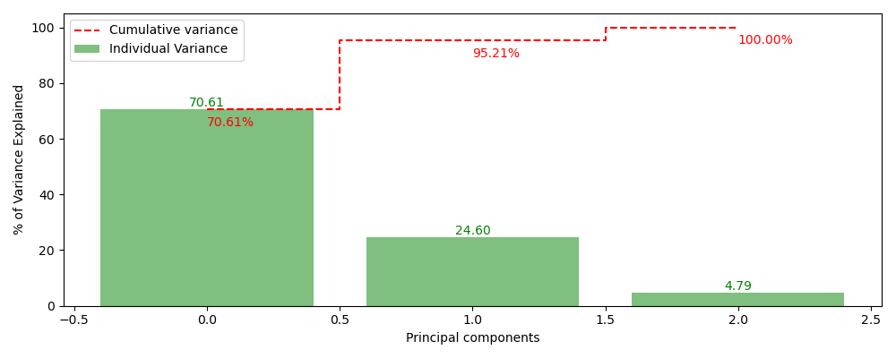
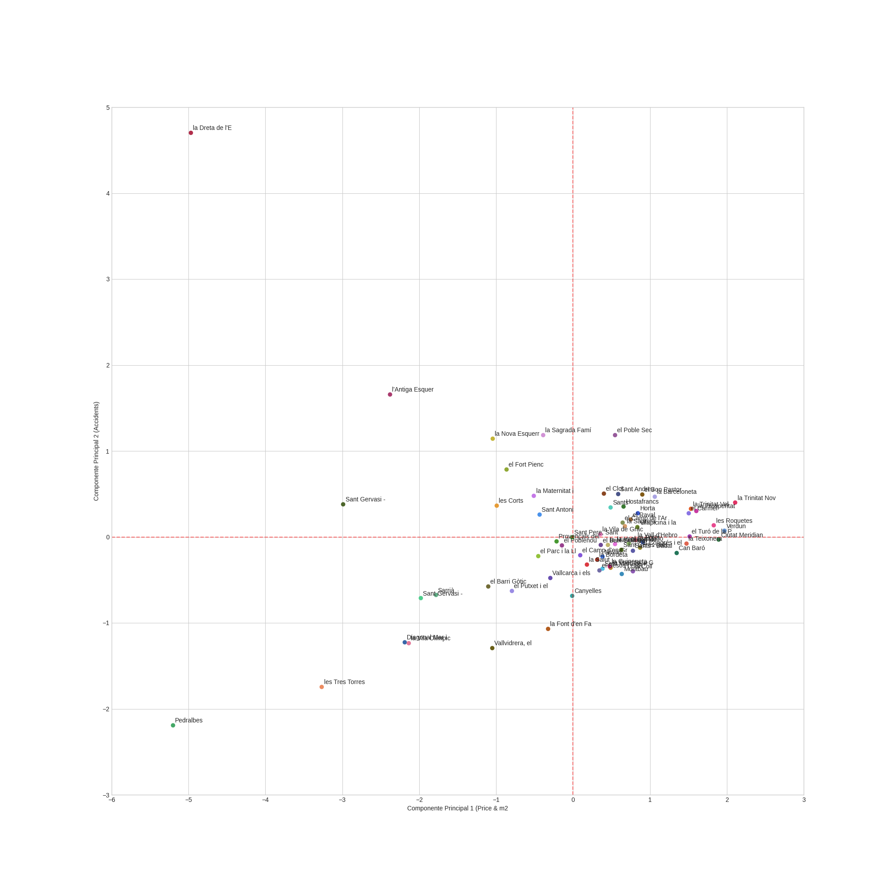
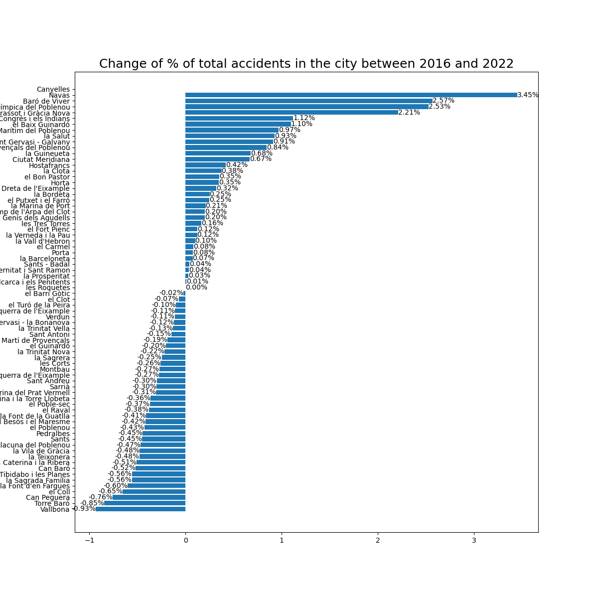
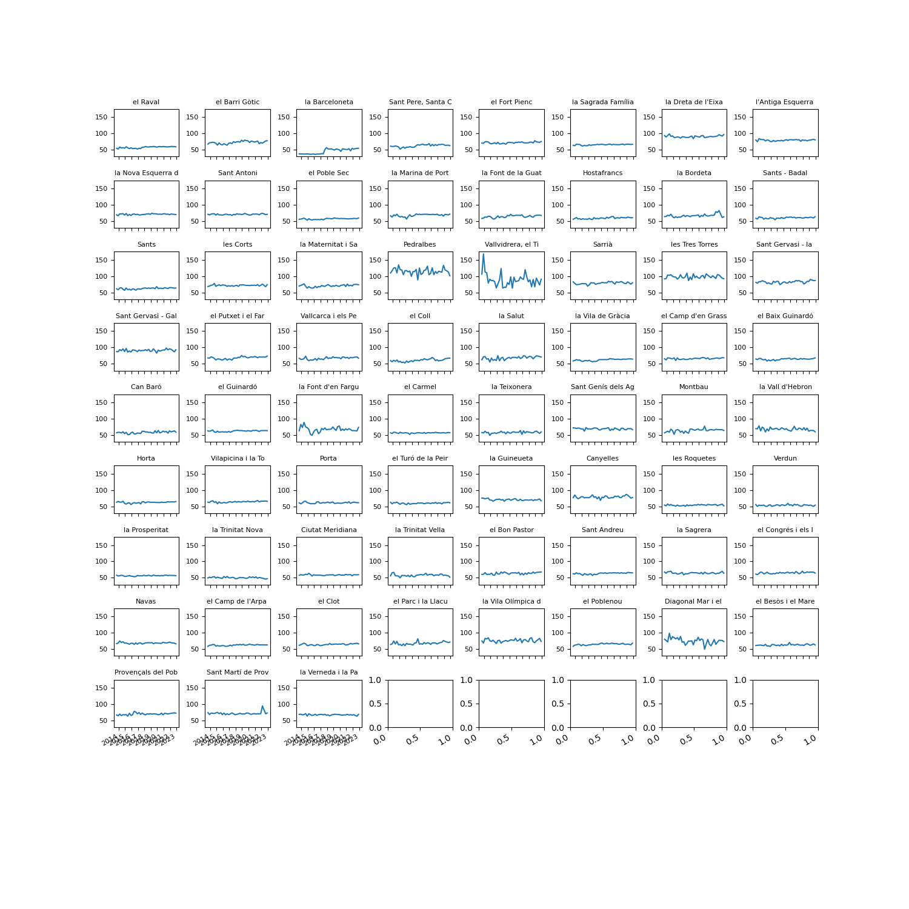

# JUMP2DIGITAL: PROVA DATA SCIENCE HACKATÓ

## Continguts Contenido Contents
0. [Prova/Prueba/Proof](#prova-prueba-proof)
1. [Introducció/Introducción/Introduction](#introducció-introducción-introduction)
2. [Tractament/Tratamiento/Processing](#tractament-tratamiento-processing)
	- [Prices/Precio/Preu](#prices-precio-preu)
	- [Accidents/Accidentes/Accidents](#accidents-accidentes-accidents)
	- [Fusionar/Unir/Merge](#fusionar-unir-merge)
	- [ACP/ACP/PCA](#acp-acp-pca)
3. [Resultats/Resultados/Results](#resultats-resultados-results)
4. [Conclusions/Conclusiones/Conclusions](#conclusions-conclusiones-conclusions)

---

## Prova Prueba Proof

|_________________________|_________________________|_________________________|
|-------------------------|-------------------------|-------------------------|
|Al [Mobile World Capital Barcelona](https://mobileworldcapital.com) impulsem el desenvolupament de l’ecosistema mòbil i digital per a posicionar Barcelona com hub de referència digital global.|[Mobile World Capital Barcelona](https://mobileworldcapital.com) Impulsa el desarrollo del ecosistema móvil y digital para posicionar Barcelona como hub de referencia digital global.|In the [Mobile World Capital Barcelona](https://mobileworldcapital.com) we promote the development of the mobile and digital ecosystem to position Barcelona as a global digital reference hub.|
|Amb suport públic i privat, MWCapital centra la seva activitat en quatre àrees: l’acceleració de la **innovació** a través de l’emprenedoria digital; la transformació de la indústria mitjançant la **tecnologia** digital; el creixement del **talent** digital entre les noves generacions i els professionals; i la reflexió sobre l’impacte de la tecnologia a la nostra **societat**.|Con apoyo público y privado, MWCapital centra su actividad en cuatro áreas: la aceleración de la **innovación** a través del emprendimiento digital; la transformación de la industria mediante la **tecnología** digital; el crecimiento del **talento** digital entre las nuevas generaciones y los profesionales; y la reflexión sobre el impacto de la tecnología en nuestra **sociedad**.|With the support of the public and private sector, MWCapital focuses on four areas: the acceleration of **innovation** through digital entrepreneurship, the transformation of industries through digital **technology**, the rise of digital **talent** among new generations and professionals, and the reflection on the impact of technology in our **society**.|
|Una de les iniciatives de MWCapital és el [Hackton JUMP2DIGITAL](https://jump2digital.site) del 17 de novembre de 2023. Per poder participar-hi cal superar una prova.|Una de sus iniciativas es el [Hackton JUMP2DIGITAL](https://jump2digital.site/es/) del 17 de noviembre de 2023. Para poder participar en el hay que superar una prueba.|One of MWCapital's initiatives is the [JUMP2DIGITAL Hackton](https://jump2digital.site/en/) on November 17, 2023. In order to participate in it, you must pass a test.|

### Conjunts de dades/Conjuntos de datos/Data sources.
|_________________________|_________________________|_________________________|
|-------------------------|-------------------------|-------------------------|
|Per a aquesta prova tenim tres fonts de dades disponibles: Preus, accidents i sorolls. Estan disponibles a la web opendata de l'ajuntament de Barcelona. A sota hi ha els enllaços a les dades.|Para estra prueba tenemos tres fuentes de datos disponibles: Precios, accidentes y ruidos. Están disponibles en la web opendata del ayuntamiento de Barcelona. Abajo están los enlaces a los datos.|For this proof we have three data sources available: Prices, accidents and noise. They are available on the Barcelona City Council's opendata website. Below are links to the data.|

[2014..2023 Llogers/Alquileres/Rent prices](https://opendata-ajuntament.barcelona.cat/data/es/dataset/est-mercat-immobiliari-lloguer-mitja-mensual/resource/0a71a12d-55fa-4a76-b816-4ee55f84d327)

[2017 Soroll/Ruido/noise](https://opendata-ajuntament.barcelona.cat/data/es/dataset/poblacio-exposada-mapa-estrategic-soroll/resource/3846500e-72aa-4780-967f-f09aa184eaba)

[2016..2022 Accidents/Accidentes/Accidents](https://opendata-ajuntament.barcelona.cat/data/ca/dataset/accidents_causa_conductor_gu_bcn/resource/1a05cdd4-4844-41a5-872d-a0824d11b517?inner_span=True)

### Missió/Misión/Mission 

|_________________________|_________________________|_________________________|
|-------------------------|-------------------------|-------------------------|
|Seleccionar dos conjunts de dades i unificar-los tenint en conta que el nostre conjunt base és el dels lloguers.|Seleccionar dos conjuntos de datos y unirlos teniendo en cuenta que nuestro conjunto base es el de los precios.|Select two sets of data and unify them bearing in mind that our base set is that of rents|
|Realitzar el preprocessament de dades necessari per garantir que les dades siguin precises.|Realizar el necesario preprocesamiento de los datos para garantizar que sean precisos.|Perform the necessary data pre-processing to ensure that the data is accurate.|
|Aplicar una anàlisi de components principals per reduir les dimensions del conjunt de dades.|Realizar un análisis de componentes principales para reducir las dimensiones del conjunto de datos.|Apply principal component analysis (PCA) to reduce the dimensions of the data set.|

### Lliurament Entrega Delivery

[Jupyter Notebook](https://github.com/luismiguelcasadodiaz/jump2digital/blob/main/LMCD_JUMP2DIGITAL.ipynb)

[README](https://github.com/luismiguelcasadodiaz/jump2digital/blob/main/README.md). 

[Torna a l'inici/Volver arriba/Back to top](#continguts-contenido-contents)
---

## Introducció Introducción Introduction
|_________________________|_________________________|_________________________|
|-------------------------|-------------------------|-------------------------|
|Presentació del conjunt de dades i de les variables seleccionades.|Presentación de los conjuntos de datos y de las variables selecionadas.|Introduction to data sets and variable selection.|

### Preus/Prices/Precios

|_________________________|_________________________|_________________________|
|-------------------------|-------------------------|-------------------------|
|Els preus del 2014 al 2023 vénen en arxius anuals. Cal integrar-los en un únic fitxer. Els preus de cada barri són trimestrals. Hi ha preus per metre quadrat i preus mensuals de lloguer d'habitatge. El 2022 en falta un trimestre i del 2023 en falten dos. S'han eliminat del conjunt de dades sis barris que tenen més NaN que dades. En un barri on només li faltaven tres trimestres s'han estimat aquests tres valors.|Los precios de los años 2014 al 2023 vienen en archivos anuales. Hay que integrarlos en un único archivo. Los precios de cada barrio son trimestrales.Hay precios por metro cuadrado y precios mensuales de alquiler de vivienda. En 2022 falta un trimestre y de 2023 faltan dos. Se han eliminado del conjunto de datos seis barrios que tiene mas NaN que datos. En un barrio al que solo le faltaban tres trimestres se han estimado estos tres valores.|Prices for the years 2014 to 2023 come in annual files. They must be integrated into a single file. The prices for each neighborhood are quarterly. There are prices per square meter and monthly housing rental prices. In 2022 there is one quarter left and in 2023 there are two left. Six neighborhoods that have more NaN than data have been removed from the data set. IN a neighborhood that only had three quarters left, these three values have been estimated.| 

|Pos|Camp/Campo/Field|Descripció/Descripción/Description|
|:--|:----------|:---------------------|
|01|Any|Any del registre/Año del registro/Record year|
|02|Trimestre|Trimestre del registre/Trimestre del registro/Record year's quarter|
|03|Codi_Districte|Codi del districte/Código del distrito/District's code|
|04|Nom_Districte|Nom del districte/Nombre del distrito/District's name|
|05|Codi_Barri|Codi del barri/Código del barrio/Neighborhood's code|
|06|Nom_Barri|Nom del barri/Nombre del barrio/Neighborhood's name|
|07|Lloguer_mitja|Explicación del preu, sigui Lloguer mitjà mensual o lloguer mitjà per superfície/Explicación del precio sea alquiler mensual o alquiler por metro/Rent definition either monthly rent or sqm montly rent|
|08|Preu|Preu lloguer/Precio del alquiler/rent value|

### Accidents/Accidents/Accidentes
|_________________________|_________________________|_________________________|
|-------------------------|-------------------------|-------------------------|
|Les dades d’aquest dataset complementen les d'Accidents gestionats per la Guàrdia Urbana a la ciutat de Barcelona|El detalle de este conjunto de datos complementa los Accidentes gestionados por la Guardia Urbana en la ciudad de Barcelona.|The details of this dataset complement the Accidents managed by the Urban Guard in the city of Barcelona|
|El valor '-1' en una cel·la indica que no es té aquesta dada.|El valor '-1' en una celda indica que no se tiene ese dato.|The value '-1' in a cell indicates that it does not have that data. |
|Les dades dels accidents dels anys 2016 al 2022 estan en fitxers anuals que cal integrar en un. Cadascun dels 69.355 registres correspon a un expedient d'accident. Hi ha 501 registres per als quals no se sap el barri de l'accident. D'aquests, 30 no tenen ni tan sols les coordenades del succés. Aquests 30 registres s'eliminen del conjunt de dades. Pels 471 registres restants que tenen coordenades de l'accident, recuperem el barri a 434 registres. Com a part del preprocessament de les dades daccidents i amb la intenció dafegir-les a les dades de preus, fem un resum del nombre daccidents per barri i trimestre.|Los datos de los accidentes de los años 2016 a 2022 están en ficheros anuales que hay que integrare en uno. Cada uno de los 69 355 registros corresponde a un expediente de accidente. Hay 501 registros para los  que se desconoce el barrio del accidente. De estos 30 no tienen nisiquiera las coordenadas del suceso. Estos 30 registros se eliminan del conjunto de datos. Para los 471 registres restantes que tienen coordenadas del accidente, recuperamos el barrio en 434 registros. Como parte del preprocesamiento de los datos de accidentes y con la intención de agregarlos a los datos de precios, hacemos un resumen del número de accidentes por barrio y trimestre.|The accident data from the years 2016 to 2022 are in annual files that must be integrated into one. Each of the 69,355 records corresponds to an accident file. There are 501 records for which the neighborhood of the accident is unknown. Of these, 30 do not even have the coordinates of the event. These 30 records are removed from the data set. For the remaining 471 records that have coordinates of the accident, we recover the neighborhood in 434 records. As part of the preprocessing of the accident data and with the intention of adding it to the price data, we summarize the number of accidents by neighborhood and quarter.| 

|Pos|Field/camp|Field description /Camp	Descripció|
|:--|:---------|:----------------------------------------------------------|
|01|Numero_expedient|Número d'expedient|
|02|Codi_districte|Codi del districte|
|03|Nom_districte|Nom del districte|
|04|Codi_barri|Nom del barri|
|05|Nom_barri|Nom del barri|
|06|Codi_carrer|Codi del carrer|
|07|Nom_carrer|Nom carrer|
|08|Num_postal|Número postal|
|09|Descripcio_dia_setmana|Nom del dia de la setmana|
|10|NK_Any|Any|
|11|Mes_any|Mes de l'any|
|12|Nom_mes|Nom del mes|
|13|Dia_mes|Dia del mes|
|14|Hora_dia|Hora del dia|
|15|Descripcio_causa_mediata|Descripció causa mediata|
|16|Descripcio_torn|Descripció del torn|
|17|Coordenada_UTM_X_ED50|Coordenada X en format UTM (ED50)|
|18|Coordenada_UTM_Y_ED50|Coordenada Y en format UTM (ED50)|
|19|Longitud_WGS84|Longitud|
|20|Latitud_WGS84|Latitud|

### Sorolls/Ruidos/Noises
|_________________________|_________________________|_________________________|
|-------------------------|-------------------------|-------------------------|
|Només hi ha dades del 2017. Les xifres de població provenen de la lectura del padró de l'any corresponent. Els percentatges que es mostren són respecte a la població del barri, districte o ciutat, segons el recurs corresponent. Per l'avaluació del soroll hi ha tres períodes horaris definits per normativa. El període dia és de 7.00 a 21.00 hores; el vespre, de 21.00 a 23.00 hores; i la nit, de 23.00 a 7.00 hores. D'aquests tres períodes s'obtenen els índexs acústics Ld, Le i Ln. A més, hi ha un quart índex acústic, el ponderat dia-vespre-nit (Lden), que correspon a una mitjana ponderada dels índexs Ld, Le i Ln, penalitzant els períodes vespre i nit.|Solamente hay datos de 2017. Las cifras de población provienen de la lectura del padrón del año correspondiente. Los porcentajes que se muestran son respecto a la población del barrio, distrito o ciudad, según el recurso correspondiente. Para la evaluación del ruido hay tres períodos horarios definidos por normativa. El período día es de 7.00 a 21.00 horas; la tarde, de 21.00 a 23.00 horas; y la noche, de 23.00 a 7.00 horas. De estos tres períodos se obtienen los índices acústicos Ld, Le y Ln. Además, hay un cuarto índice acústico, el ponderado día-tarde-noche (Lden), que corresponde a una media ponderada de los índices Ld, Le y Ln, penalizando los períodos tarde y noche.|There is only data from 2017. Population data comes from the reading of the municipal register the corresponding year. The percentages shown are with respect the population of the neighbourhood, district or city, according to the corresponding resource. For noise evaluation there are three time periods defined by regulation. The day period is from 7 am to 9 pm, evening from 9 pm to 11 pm, and night from 11 pm to 7 am. From these three periods, the noise indicators Ld, Le and Ln are obtained. In addition, there is a fourth indicator, the weighted day-evening-night (Lden), which corresponds to a weighted average of the Ld, Le and Ln indicators, penalizing the evening and night periods.|

###  Estructura en format LONG (Vertical)

|Pos|Camp/Field/Campo|/Descripció/Description/Descripción|Registres/Records/Registros|
|:--|:---------|:----------------------------------------------------------|-------:|
|01|Codi_Districte|Codi del districte / Código del distrito / District's code|18980|
|02|Nom_Districte|Nom del districte / Nombre del distrito / District's name|18980|
|03|Codi_Barri|Codi del barri / Código del barrio / Neighbourhood's code|18980|
|04|Nom_Barri|Nom del barri / Nombre del barrio / Neighbourhood's name|18980|
|05|Rang_soroll|Rang de soroll / Rango de ruido / Noise range|18980|
|06|Concepte|Concepte/Concepto/Concept|18980|
|07|Valor|Valor/Valor/Value|18980|
  
  
### Estructura en format WIDE (Horizontal)

|Pos|Camp/Field/Campo|/Descripció/Description/Descripción|Registres/Records/Registros|
|:--|:---------|:----------------------------------------------------------|-------:|
|01|Codi_Districte|Codi del districte / Código del distrito / District's code|730|
|02|Nom_Districte|Nom del districte / Nombre del distrito / District's name|730|
|03|Codi_Barri|Codi del barri / Código del barrio / Neighbourhood's code|730|
|04|Nom_Barri|Nom del barri / Nombre del barrio / Neighbourhood's name|730|
|05|Rang_soroll|Rang de soroll / Rango de ruido / Noise range|730|
|06|TOTAL_D|Soroll total en període dia / Ruido total en período día / Total noise in day period|730|
|07|TOTAL_E|Soroll total en període vespre / Ruido total en período tarde / Total noise in evening period|730|
|08|TOTAL_N|Soroll total en període nit / Ruido total en período noche / Total noise in night period|730|
|09|TOTAL_DEN|Soroll total en període Lden / Ruido total en período Lden / Total noise in Lden period|730|
|10|TRANSIT_D|Soroll de trànsit viari en període dia / Ruido de tráfico viario en período día / Road traffic noise in day period|730|
|11|TRANSIT_E|Soroll de trànsit viari en període vespre / Ruido de tráfico viario en período tarde / Road traffic noise in evening period|730|
|12|TRANSIT_N|Soroll de trànsit viari en període nit / Ruido de tráfico viario en período noche / Road traffic noise in night period|730|
|13|TRANSIT_DEN|Soroll de trànsit viari en període Lden / Ruido de tráfico viario en período Lden / Road traffic noise in Lden period|730|
|14|GI_TR_D|Soroll de grans infraestructures viàries en període dia / Ruido de grandes infraestructuras viarias en período día / Major road traffic noise in day period|730|
|15|GI_TR_E|Soroll de grans infraestructures viàries en període vespre / Ruido de grandes infraestructuras viarias en período tarde / Major road traffic noise in evening period|730|
|16|GI_TR_N|Soroll de grans infraestructures viàries en període nit / Ruido de grandes infraestructuras viarias en período noche / Major road traffic noise in night period|730|
|17|GI_TR_DEN|Soroll de grans infraestructures viàries en període Lden / Ruido de grandes infraestructuras viarias en período Lden / Major road traffic noise in Lden period|730|
|18|FFCC_D|Soroll d’eixos ferroviaris i tramvia en període dia / Ruido de ejes ferroviarios y tranvía en período día / Railway noise in day period|730|
|19|FFCC_E|Soroll d’eixos ferroviaris i tramvia en període vespre / Ruido de ejes ferroviarios y tranvía en período tarde / Railway noise in evening period|730|
|20|FFCC_N|Soroll d’eixos ferroviaris i tramvia en període nit / Ruido de ejes ferroviarios y tranvía en período noche / Railway noise in night period|730|
|21|FFCC_DEN|Soroll d’eixos ferroviaris i tramvia en període Lden / Ruido de ejes ferroviarios y tranvía en período Lden / Railway noise in Lden period|730|
|22|INDUST_D|Soroll d’indústria en període dia / Ruido de industria en período día / Industrial noise in day period|730|
|23|INDUST_E|Soroll d’indústria en període vespre / Ruido de industria en período tarde / Industrial noise in evening period|730|
|24|INDUST_N|Soroll d’indústria en període nit / Ruido de industria en período noche / Industrial noise in night period|730|
|25|INDUST_DEN|Soroll d’indústria en període Lden / Ruido de industria en período Lden / Industrial noise in Lden period|730|
|26|VIANANTS_D|Soroll en carrers de vianants en període dia / Ruido en calles peatonales en período día / Noise in pedestrian streets in day period|730|
|27|VIANANTS_E|Soroll en carrers de vianants en període vespre / Ruido en calles peatonales en período tarde / Noise in pedestrian streets in evening period|730|
|28|OCI_N|Soroll d’oci i aglomeració de persones en període nit / Ruido de ocio y aglomeración de personas en período noche / Recreational noise in night period|730|
|29|PATIS_D|Soroll en patis interiors d’illa en període dia / Ruido en patios interiores en período día / Noise in inner courtyards in day period|730|
|30|PATIS_E|Soroll en patis interiors d’illa en període vespre / Ruido en patios interiores en período tarde / Noise in inner courtyards in evening period|730|
|31|PARCS_D|Soroll en parcs en període dia / Ruido en parques en período día / Noise in parks in day period|730|

[Torna a l'inici/Volver arriba/Back to top](#continguts-contenido-contents)

## Tractament Tratamiento Processing

|_________________________|_________________________|_________________________|
|-------------------------|-------------------------|-------------------------|
|Descripció detallada de les tècniques de preprocessat aplicades i els criteris d’avaluació utilitzats.|Descripción detallada de las técnicas de preprocesado aplicadas i los criterios de evaluación usados.|Detailed description of preprocessing methods applied and evaluation criteria.|

### Prices Precio Preu

|Pos|Field/Campo|Description/Descripció|
|:--|:----------|:---------------------|
|01|Any|Any de les dades|
|02|Trimestre|Trimestre de les dades|
|03|Codi_Districte|Codi del districte|
|04|Nom_Districte|Nom del districte|
|05|Codi_Barri|Codi del barri|
|06|Nom_Barri|Nom del barri|
|07|Lloguer_mitja|Lloguer mitjà mensual i lloguer mitjà per superfície|
|08|Preu|Preu lloguer|

|_________________________|_________________________|_________________________|
|-------------------------|-------------------------|-------------------------|
|Els 8 primers anys hi ha 584 preus per any.|En los 8 primeros años hay 584 precios por año.|In the first 8 years there are 584 prices per year.|
|A cada any tenim una dada per trimestre (4 trimestres).|En cada año tenemos un dato por trimestre (4 trimestres).|In each year we have one data per quarter (4 quarters).|
|La dada trimestral té dos valors: (2 preus) "Lloguer de mitjana mensual d'un pis" i "Lloguer de mitjana mensual d'un m2"|El dato trimestral tiene dos valores: (2 precios) "Alquiler promedio mensual de un piso" y "Alquiler promedio mensual de un m2"|The quarterly data has two values: (2 prices) "Average monthly rent of an apartment" and "Average monthly rent of a m2"|
|Cadascun dels 73 barris de Barcelona té registres per contenir aquestes dades.|Cada uno de los 73 barrios de Barcelona tiene registros para contener esos datos.|Each of the 73 neighborhoods of Barcelona has records to contain this data.|
|En total 73 barris x 2 preus x 4 trimestres = 584 registres cada any.|En total 73 barrios x 2 precios x 4 trimestres = 584 registros al año.|In total 73 neighborhoods x 2 prices x 4 quarters = 584 registrations per year.|
|L'any 2022 manquen els preus de quart trimestre. L'any 2023 manquen els preus del tercer i del quart quadrimestre.|En el año 2022 faltan los precios de cuarto trimestre. En el año 2023 faltan los precios del tercero y del cuarto cuatrimestre.|In 2022, the fourth quarter prices are missing. In 2023, the prices for the third and fourth quarters are missing.|
|Les dades de preus tenen 5402 files per 8 columnes.|Los datos de precios tienen 5402 filas por 8 columnas|The price data has 5402 rows by 8 columns.|

 
|Camp/field/Campo|2014|2015|2016|2017|2018|2019|2020|2021|2022|2023|
|---|---|---|---|---|---|---|---|---|---|---|
|Any|584|584|584|584|584|584|584|584|438|292|
|Trimestre|584|584|584|584|584|584|584|584|438|292|
|Codi_Districte|584|584|584|584|584|584|584|584|438|292|
|Nom_Districte|584|584|584|584|584|584|584|584|438|292|
|Codi_Barri|584|584|584|584|584|584|584|584|438|292|
|Nom_Barri|584|584|584|584|584|584|584|584|438|292|
|Lloguer_mitja|584|584|584|584|584|584|584|584|438|292|
|Preu|546|552|553|546|540|538|538|584|406|273|

|_________________________|_________________________|_________________________|
|-------------------------|-------------------------|-------------------------|
|Què passa amb les dades faltants?|¿que pasa con los datos faltantes?|What about missing data?|

|Camp/field/Campo|2014|2015|2016|2017|2018|2019|2020|2021|2022|2023|Total|
|--|----|----|----|----|----|----|----|----|----|----|-----|
|Preu = NaN0|38|32|31|38|44|46|46|44|32|19|=326

|_________________________|_________________________|_________________________|
|-------------------------|-------------------------|-------------------------|
|Al camp Preu, 326 registres dels 5402, no tenen valor. Això és un 6,03% de les dades.|En el campo Preu, 326 registros de los 5402, no tiene valor.Esto es un 6,03 % de los datos.|In the Preu field, 326 records of the 5402 have no value. This is 6.03% of the data.|

|_________________________|_________________________|_________________________|
|-------------------------|-------------------------|-------------------------|
|El primer tractament del preprocessat serà unir en un únic registre trimestral els dos tipus de preu existents, creat per a això dues noves columnes "Eur" i "Eur_m2". Per això es creem primer una clau que ens permeti unir les dades posteriorment. Aquesta clau té el codi de barri l'any i el trimestre. Dividim els preus en dos subconjunts: un subconjunt amb els registres que contenen el preu de tipus "Lloguer de mitjana mensual d'un pis" i un altre subconjunt amb els registres que conté el preu del tipus "Lloguer de mitjana mensual d'un m2". A cada subconjunt canviem adequadament el nom de la columna preu i fusionem els dos subconjunt per la clau creada.|El primer tratamiento del preprocesado será unir en  un único registro trimestrasl los dos tipos de precio existentes, creado para ello dos nueva columnas "Eur" y "Eur_m2". Para ellos creamos primero una clave que nos permita unir los datos posteriormente. Esta clave tiene el codigo de barrio el año y el trimestre. Dividimos los precios en dos subconjuntos: un subconjunto con los registros que contienen el precio de tipo "Alquiler promedio mensual de un piso" y otro subconjunto con los registros que contiene el precio del tipo "Alquiler promedio mensual de un m2". En cada subconjunto cambiamos adecuadamente el nombre de la columna precio y fusionamos los dos subconjunto por la clave creada.|The first preprocessing treatment will be to unite the two existing price types into a single quarterly record, creating two new columns "Eur" and "Eur_m2" for this purpose. To do this, we first create a key that allows us to join the data later. This key has the neighborhood code, the year and the quarter. We divide the prices into two subsets: a subset with the records that contain the price of the type "Average monthly rent of an apartment" and another subset with the records that contain the price of the type "Average monthly rent of a m2." In each subset we appropriately rename the price column and merge the two subsets by the created key.|
|Amb les dades de preu calculem la superfície mitjana dels apartaments considerats en una columna “m2”.|Con los datos de precio calculamos la superficie media de los apartamentos considerados en una columna "m2".|With the price data we calculate the average surface area of the apartments considered in a "m2" column.|
|Creem una columna data amb el primer dia del trimestre. Això ens ajudarà a graficar levolució en el temps de les dades dels barris.|Creamos una columna fecha con el primer día del trimestre. Esto nos ayudaŕa a graficar la evolución en el tiempo de los datos de los barrios.|We create a date column with the first day of the quarter. This will help us graph the evolution of neighborhood data over time.|
|El resultat de la transformació son 2701 files de 9 columnes:|El resultado de la transformación son 2701 filas de 9 columnas:|The result of the transformation is 2701 rows of 9 columns:|

|    |Any |Trimestre| Nom_Districte| Nom_Barri              |Eur    |Clau   |Eur_m2|Date      |m2       |
|----|----|---------|--------------|------------------------|-------|-------|------|----------|---------|
|0   |2014|1        |Ciutat Vella  |el Raval                | 589.55| 120141|10.76 |2014-01-01|54.790892|
|1   |2014|1        |Ciutat Vella  |el Barri Gòtic          | 712.79| 220141|10.58 |2014-01-01|67.371456|
|2   |2014|1        |Ciutat Vella  |la Barceloneta          | 540.71| 320141|14.40 |2014-01-01|37.549306|
|2698|2023|2        |Sant Martí    |Provençals del Poblenou |1204.20|7120232|16.70 |2023-04-01|72.107784|
|2699|2023|2        |Sant Martí    |Sant Martí de Provençals| 960.90|7220232|13.20 |2023-04-01|72.795455|
|2700|2023|2        |Sant Martí    |la Verneda i la Pau     | 991.10|7320232|14.50 |2023-04-01|68.351724|

|_________________________|_________________________|_________________________|
|-------------------------|-------------------------|-------------------------|
|Quan analitzem els registres amb NAN a la columna "Eur", veiem que estan repartits per tot el conjunt de dades.|Cuando analizamos los registros con NAN en la columna "Eur", vemos que están repartidos por todo el conjunto de datos.| When we analyze the records with NAN in the "Eur" column, we see that they are distributed throughout the data set.|

|Trimestre| 1|2|3|4|sum|%|
|----|---:|---:|---:|---:|---:|---:|
|2014|5|3|5|6|19|6.51%|
|2015|6|2|4|4|16|5.48%|
|2016|2|5|4|4|15|5.14%|
|2017|5|4|5|5|19|6.51%|
|2018|6|5|6|5|22|7.53%|
|2019|6|6|6|5|23|7.88%|
|2020|4|7|6|6|23|7.88%|
|2021|6|5|6|5|22|7.53%|
|2022|6|5|5|nan|16|7.30%|
|2023|4|5|nan|nan|09|6.16%|
|**Tot**|**50**|**47**|**47**|**40**|**184**|**6.81%**|

|_________________________|_________________________|_________________________|
|-------------------------|-------------------------|-------------------------|
|Quan analitzem els registres amb NAN a la columna "Eur_m2"", veiem que estan repartits per tot el conjunt de dades.|Cuando analizamos los registros con NAN en la columna "Eur_m2"", vemos que están repartidos por todo el conjunto de datos.| When we analyze the records with NAN in the "Eur_m2"" column, we see that they are distributed throughout the data set.|

|Trimestre| 1|2|3|4|sum|%|
|----|---:|---:|---:|---:|---:|---:|
|2014|5|3|5|6|19|6.51%|
|2015|6|2|4|4|16|5.48%|
|2016|2|5|5|4|16|5.48%|
|2017|5|4|5|5|19|6.51%|
|2018|6|5|6|5|22|7.53%|
|2019|6|6|6|5|23|7.88%|
|2020|4|7|6|6|23|7.88%|
|2021|6|5|6|5|22|7.53%|
|2022|6|5|5|nan|16|7.30%|
|2023|5|5|nan|nan|10|6.84%|
|**Tot**|**51**|**47**|**48**|**40**|**186**|**6.81%**|

|_________________________|_________________________|_________________________|
|-------------------------|-------------------------|-------------------------|
|La manca de preus afecta 7 barris. Calculem el percentatge de dades mancants considerant 8 anys complets (2014..2020), 32 trimestres, més tres trimestres del 2021, 35 trimestres, més dos trimestres del 2023, 37 trimestres. 37 trimestres són els que un barri “complet” hauria de tenir.|La falta de precios afecta a 7 barrios. Calculamos el porcentaje de datos faltantes considerando 8 años completos (2014..2020), 32 trimestres, mas tres trimestres del 2021, 35 trimestres, mas dos trimestres de 2023, 37 trimestres, son los que un barrio con toda la información debería tener.|The lack of prices affects 7 neighborhoods. We calculate the percentage of missing data considering 8 complete years (2014..2020), 32 quarters, plus three quarters of 2021, 35 quarters, plus two quarters of 2023, 37 quarters. 37 quarters are what a "complete" neighborhood should have.|

|Barri                     |Euros|Euros_m2|%datos faltantes|
|--------------------------|-----|--------|---|
|Baró de Viver             |   27|      27|73%|
|Can Peguera               |   32|      32|86%|
|Canyelles                 |    3|       3|08%|
|Torre Baró                |   23|      24|65%|
|Vallbona                  |   34|      34|92%|
|la Clota                  |   36|      36|97%|
|la Marina del Prat Vermell|   29|      30|81%|

|_________________________|_________________________|_________________________|
|-------------------------|-------------------------|-------------------------|
|Estimarem els 3 valors faltants al barri de Canyelles, calculant la mitjana mòbil dels valors previs. Els altres sis barris amb dades faltants, a causa de l'alt nombre de dades faltants, els esborrarem del conjunt de dades de preus. Sis barris per 37 registres per barri suposen la supressió de 222 registres.|Estimaremos los 3 valores faltantes en el barrio de Canyelles, calculando la media movil de los valores previos. Los otros seis barrios con datos faltantes, debido al alto número de datos faltantes, los borraremos del conjunto de datos de precios. Seis barrios por 37 registros por barrio suponen la supresion de 222 registros.|We will estimate the 3 missing values in the Canyelles neighborhood, calculating the moving average of the previous values. The other six neighborhoods with missing data, due to the high number of missing data, we will delete from the price data set. Six neighborhoods for 37 records per neighborhood mean the deletion of 222 records.|
|El resultat es desa en un fitxer csv "prices_14_23.csv"|El resultado se guarda en un archivo csv "prices_14_23.csv"|The result is saved in a csv file "prices_14_23.csv"|

[Torna a l'inici/Volver arriba/Back to top](#continguts-contenido-contents)

### Accidents Accidentes Accidents
|_________________________|_________________________|_________________________|
|-------------------------|-------------------------|-------------------------|
|Les dades d’aquest dataset complementen les d'Accidents gestionats per la Guàrdia Urbana a la ciutat de Barcelona|El detalle de este conjunto de datos complementa los Accidentes gestionados por la Guardia Urbana en la ciudad de Barcelona.|The details of this dataset complement the Accidents managed by the Urban Guard in the city of Barcelona|
|El valor '-1' en una cel·la indica que no es té aquesta dada.|El valor '-1' en una celda indica que no se tiene ese dato.|The value '-1' in a cell indicates that it does not have that data.|

|Pos|Field/camp|Field description /Camp	Descripció|
|:--|:---------|:----------------------------------------------------------|
|01|Numero_expedient|Número d'expedient|
|02|Codi_districte|Codi del districte|
|03|Nom_districte|Nom del districte|
|04|Codi_barri|Nom del barri|
|05|Nom_barri|Nom del barri|
|06|Codi_carrer|Codi del carrer|
|07|Nom_carrer|Nom carrer|
|08|Num_postal|Número postal|
|09|Descripcio_dia_setmana|Nom del dia de la setmana|
|10|NK_Any|Any|
|11|Mes_any|Mes de l'any|
|12|Nom_mes|Nom del mes|
|13|Dia_mes|Dia del mes|
|14|Hora_dia|Hora del dia|
|15|Descripcio_causa_mediata|Descripció causa mediata|
|16|Descripcio_torn|Descripció del torn|
|17|Coordenada_UTM_X_ED50|Coordenada X en format UTM (ED50)|
|18|Coordenada_UTM_Y_ED50|Coordenada Y en format UTM (ED50)|
|19|Longitud_WGS84|Longitud|
|20|Latitud_WGS84|Latitud|

|_________________________|_________________________|_________________________|
|-------------------------|-------------------------|-------------------------|
|Després de Concatenar els set anys de registres d'accidents, tot i que tots els fitxers tenen 20 columnes, podem observar aquestes anomalies: |Tras Concatenar los siete años de registros de accidentes, aunque todos los ficheros tienen 20 columnas, podemos obeservar estas anomalías:|After concatenating the seven years of accident records, although all the files have 20 columns, we can observe these anomalies:|
|1. El camp per a la causa de l'accident té dos noms: "Descripcio_causa_conductor" [2016.. 2020] i "Descripcio_causa_mediata" [2021.. 2022].|1. El campo para la causa del accidente tiene dos nombres: "Descripcio_causa_conductor" [2016 .. 2020] y "Descripcion_causa_mediata"  [2021 .. 2022].|1. The field for the cause of the accident has two names: "Descripcio_causa_conductor" [2016 .. 2020] and "Descripcion_causa_mediata" [2021 .. 2022].|
|2. Intercanvi del contingut de dos camps. "Descripcio_torn" té valors de "Descripcio_causa_Conductor" [2016..2020].|2. Intercambio del contenido de dos campos. "Descripcio_torn" tiene valores de "Descripcion_causa_Conductor" [2016..2020].|2. Exchange of the content of two fields. "Descripcio_torn" has values of "Descripcion_causa_Conductor" [2016..2020].|

| |2016|2017|2018|2019|2020|2021|2022|
|--------------- |---:|---:|---:|---:|---:|---:|---:|
|Numero_expedient|10510.0|11091.0|10835.0|11025.0|7595.0|8979.0|9320.0|
|Codi_districte|10510.0|11091.0|10835.0|11025.0|7595.0|8979.0|9320.0|
|Nom_districte|10510.0|11091.0|10835.0|11025.0|7595.0|8979.0|9320.0|
|Codi_barri|10510.0|11091.0|10835.0|11025.0|7595.0|8979.0|9320.0|
|Nom_barri|10510.0|11091.0|10835.0|11025.0|7595.0|8979.0|9320.0|
|Codi_carrer|10510.0|11091.0|10835.0|11025.0|7595.0|8979.0|9320.0|
|Nom_carrer|10510.0|11091.0|10835.0|11025.0|7595.0|8979.0|9319.0|
|Num_postal|10510.0|11089.0|10835.0|11018.0|7589.0|8979.0|9319.0|
|Descripcio_dia_setmana|10510.0|11091.0|10835.0|11025.0|7595.0|8979.0|9320.0|
|NK_Any|10510.0|11091.0|10835.0|11025.0|7595.0|8979.0|9320.0|
|Mes_any|10510.0|11091.0|10835.0|11025.0|7595.0|8979.0|9320.0|
|Nom_mes|10510.0|11091.0|10835.0|11025.0|7595.0|8979.0|9320.0|
|Dia_mes|10510.0|11091.0|10835.0|11025.0|7595.0|8979.0|9320.0|
|Hora_dia|10510.0|11091.0|10835.0|11025.0|7595.0|8979.0|9320.0|
|Descripcio_torn|10510.0|11091.0|10835.0|11025.0|7595.0|8979.0|9320.0|
|Descripcio_causa_conductor|10510.0|11091.0|10835.0|11025.0|7595.0|NaN|NaN|
|Coordenada_UTM_X_ED50|10510.0|11091.0|10835.0|11025.0|7595.0|8979.0|9320.0|
|Coordenada_UTM_Y_ED50|10510.0|11091.0|10835.0|11025.0|7595.0|8979.0|9320.0|
|Longitud|10510.0|11091.0|10835.0|11025.0|7595.0|8949.0|9320.0|
|Latitud|10510.0|11091.0|10835.0|11025.0|7595.0|8949.0|9320.0|
|Descripcio_causa_mediata|NaN|NaN|NaN|NaN|NaN|8979.0|9320.0|

|_________________________|_________________________|_________________________|
|-------------------------|-------------------------|-------------------------|
|Després de la correcció, la visió global de les dades és aquesta:|Tras la correción, la visión global de los datos es esta:|After the correction, the global view of the data is this:|

||2016|2017|2018|2019|2020|2021|2022|
|-----------|----|----|----|----|----|----|----|
|Numero_expedient|10510|11091|10835|11025|7595|8979|9320|
|Codi_districte|10510|11091|10835|11025|7595|8979|9320|
|Nom_districte|10510|11091|10835|11025|7595|8979|9320|
|Codi_barri|10510|11091|10835|11025|7595|8979|9320|
|Nom_barri|10510|11091|10835|11025|7595|8979|9320|
|Codi_carrer|10510|11091|10835|11025|7595|8979|9320|
|Nom_carrer|10510|11091|10835|11025|7595|8979|9319|
|Num_postal|10510|11089|10835|11018|7589|8979|9319|
|Descripcio_dia_setmana|10510|11091|10835|11025|7595|8979|9320|
|NK_Any|10510|11091|10835|11025|7595|8979|9320|
|Mes_any|10510|11091|10835|11025|7595|8979|9320|
|Nom_mes|10510|11091|10835|11025|7595|8979|9320|
|Dia_mes|10510|11091|10835|11025|7595|8979|9320|
|Hora_dia|10510|11091|10835|11025|7595|8979|9320|
|Causa|10510|11091|10835|11025|7595|8979|9320|
|Torn|10510|11091|10835|11025|7595|8979|9320|
|Coordenada_UTM_X_ED50|10510|11091|10835|11025|7595|8979|9320|
|Coordenada_UTM_Y_ED50|10510|11091|10835|11025|7595|8979|9320|
|Longitud|10510|11091|10835|11025|7595|8949|9320|
|Latitud|10510|11091|10835|11025|7595|8949|9320|

|_________________________|_________________________|_________________________|
|-------------------------|-------------------------|-------------------------|
|És un set de dades de 69 355 files por 20 columnes.Té 30 registres amb NaN a Logitud ia Latitud i amb les coordenades UTM desconegudes (-1). Esborrem del dataset aquests 30 registres.|Es un set de datos de 69 355 filas por 20 columnas.Tiene 30 registros con NaN en Logitud y en Latitud y con las coordenadas UTM desconocidas (-1). Borramos del dataset esos 30 registros.|It is a data set of 69,355 rows by 20 columns. It has 30 records with NaN in Longitude and Latitude and with unknown UTM coordinates (-1). We delete those 30 records from the dataset.|

|Nom_barri|Nom_carrer|Coordenada_UTM_X_ED50|Coordenada_UTM_Y_ED50|Longitud|Latitud|
|---------|----------|---------------------|---------------------|--------|-------|
|52129|Desconegut|Desconegut|-1.0|-1.0|NaN|NaN|
|52130|Desconegut|Desconegut|-1.0|-1.0|NaN|NaN|
|52131|Desconegut|Desconegut|-1.0|-1.0|NaN|NaN|
|52132|Desconegut|Desconegut|-1.0|-1.0|NaN|NaN|
|52133|Desconegut|Desconegut|-1.0|-1.0|NaN|NaN|
|||||||
|58948|Desconegut|Desconegut|-1.0|-1.0|NaN|NaN|
|58949|Desconegut|Desconegut|-1.0|-1.0|NaN|NaN|

|_________________________|_________________________|_________________________|
|-------------------------|-------------------------|-------------------------|
|Encara queden 471 accidents el barri dels quals és desconegut, però tenen les coordenades del lloc de l'accident. Intentarem esbrinar en quin barri han passat.|Aún quedan 471 accidentes cuyo barrio es desconocido, pero que tienen las coordenadas del lugar del accidente. Vamos a intentar averiguar en que barrio han sucedido.|There are still 471 accidents whose neighborhood is unknown, but they have the coordinates of the accident site. Let's try to find out in which neighborhood it happened.|

|Nom_barri|Nom_carrer|Coordenada_UTM_X_ED50|Coordenada_UTM_Y_ED50|Longitud|Latitud|
|---------|----------|---------------------|---------------------|--------|-------|
|1281|Desconegut|Desconegut|426830.03|4576250.78|2.124450|41.332574|
|1|Desconegut|ALMIRALL CERVERA / Sevilla ...|432316.21|4581276.81|2.154737|41.376367|
|2|Desconegut|NÚMERO 3 / E ...|427265.97|4576644.81|2.157427|41.381284|
|3|Desconegut|RDA DALT (BESÒS) ...|424991.14|4581760.18|2.157427|41.381284|
|0|Desconegut|NÚMERO 6 / A ...|427519.99|4575229.36|2.165891|41.375166|

|_________________________|_________________________|_________________________|
|-------------------------|-------------------------|-------------------------|
|Amb l'ajuda de `geopandes` importem un Shapefile amb els polígons dels barris de Barcelona i fem un `join within` per determinar quins polígons contenen les coordenades dels accidents. Això ens permet localitzar 434 accidents dels 471 que teníem amb la ubicació desconeguda. Amb això aconseguim un set de dades de 69 288 files i 20 columnes.|Con la ayuda de `geopandas` importamos un Shapefile con los polígonos de los barrios de Barcelona y hacemos un `join within` para determinar que polígonos contienen las coordenadas de los accidentes. Esto nos permite localizar 434 accidentes de los 471 que teníamos con la ubicación desconocida. Con esto conseguimos un set de datos de 69 288 filas y 20 columnas.|With the help of `geopandas` we import a Shapefile with the polygons of the Barcelona neighborhoods and do a `join within` to determine which polygons contain the coordinates of the accidents. This allows us to locate 434 accidents of the 471 we had with the unknown location. With this we get a data set of 69,288 rows and 20 columns.|
|Resumim les dades d'accidents per barri i per trimestre per afegir, a la fase de transformació, les dades de preus. A part comptar els accidents per trimestre al barri, els desglossem en els que han passat en cadascun dels intervals horaris (matí tarda i nit) en números absoluts i en percentatge. Una vista del resultat és: |Resumimos los datos de accidentes por barrio y por trimestre para, en la fase de transformación, añadirlos a los datos de precios. A parte contar los accidentes por trimestre en el barrio, los desglosamos en los que han ocurrido en cada uno de los intervalos horarios (mañana tarde y noche) en números absolutos y en porcentaje. Una vista del resultado es:|We summarize the accident data by neighborhood and by quarter to, in the transformation phase, add them to the price data. Apart from counting the accidents by quarter in the neighborhood, we break them down into those that have occurred in each of the time intervals (morning, afternoon and night) in absolute numbers and percentage. A view of the result is:|

||Clau|Accidents|Mat|Tar|Nit|Mat_P|Tar_p|Nit_p|
|-|----|---------|---|---|---|-----|-----|-----|
|0|0320163|1|1.0|0.0|0.0|1.000000|0.000000|0.000000|
|1|0320192|1|0.0|1.0|0.0|0.000000|1.000000|0.000000|
|2|0420172|1|0.0|1.0|0.0|0.000000|1.000000|0.000000|
|3|0420182|1|0.0|1.0|0.0|0.000000|1.000000|0.000000|
|4|0420183|1|1.0|0.0|0.0|1.000000|0.000000|0.000000|
|...|...|...|...|...|...|...|...|...|
|1540|920212|104|37.0|57.0|10.0|0.355769|0.548077|0.096154|
|1541|920213|120|53.0|59.0|8.0|0.441667|0.491667|0.066667|
|1542|920221|105|33.0|57.0|15.0|0.314286|0.542857|0.142857|
|1543|920222|100|41.0|46.0|13.0|0.410000|0.460000|0.130000|
|1544|920223|117|51.0|51.0|15.0|0.435897|0.435897|0.128205|

|_________________________|_________________________|_________________________|
|-------------------------|-------------------------|-------------------------|
|Recordeu aquí que la clau està formada pel codi del barri, l'any i el trimestre. El resultat es desa en un fitxer csv "accidents_trimestrals_16_22.csv"|Recordar aqui que la clave está formada por el código del barrio, el año y el trimestre. El resultado se guarda en un archivo csv "accidents_trimestrals_16_22.csv"|Remember here that the key is made up of the neighborhood code, the year and the quarter. The result is saved in a csv file "accidents_trimestrals_16_22.csv"|

[Torna a l'inici/Volver arriba/Back to top](#continguts-contenido-contents)

### Fusionar Unir Merge

|_________________________|_________________________|_________________________|
|-------------------------|-------------------------|-------------------------|
|Tenint en compte que hem tingut la precaució de crear una clau de fusió en cadascun dels dos conjunts de dades, aquesta operació és senzilla en aquest moment.|Habida cuenta que hemos tenido la precaución de crear una clave de fusión en cada uno de los dos conjuntos de datos, esta operación es sencilla en este momento.|Since we have taken the precaution of creating a merge key on each of the two data sets, this operation is simple at this point.|
|De l'arxiu preus vénen 2479 registres de 67 barris. Cobreixen un espai temporal des del 2014 a meitat del 2023. (vam esborrar 6 barris als quals faltaven moltes dades). De l'arxiu accidents vénen 2046 registres de 73 barris. Cobreixen un espai temporal des del 2016 al 2022.|Del archivo  precios vienen 2479 registros de 67 barrios. Cubren un espacio temporal desde 2014 a mitad de 2023. (borramos 6 barrios a los que les faltaban muchos datos). Del archivo accidentes vienen 2046 registros de 73 barrios. Cubren un espacio temporal desde 2016 al 2022.|From the prices file come 2479 records from 67 neighborhoods. They cover a time period from 2014 to mid-2023. (we deleted 6 neighborhoods that were missing a lot of data). From the accident file come 2046 records from 73 neighborhoods. They cover a time period from 2016 to 2022.|
|La clau està composta pel codi del barri concatenat a l'any i concatenat al trimestre.|La clave está compuesta por el código del barrio concatenado al año y concatenado al trimestre.|The key is composed of the neighborhood code concatenated to the year and concatenated to the quarter.|
|La unió produeix 1802 registres de 67 municipis cobrint un espai temporal des del 2016 al tercer trimestre del 2022.|La unión produce 1802 registros de 67 municipios cubriendo un espacio temporal desde 2016 al tercer trimestre de 2022.|The union produces 1,802 records from 67 municipalities covering a period from 2016 to the third quarter of 2022.|
|En aquest pas també fem la selecció de les columnes amb què farem l'anàlisi PCA. Preu mitjà a Euros de lloguer un apartament al barri, metres quadrats mitjana dels apartaments al barri i nombre d'accidents que hi ha hagut al barri en aquest trimestre.|En este paso también hacemos la selección de las columnas con las que vamos a hacer el análisis PCA. Precio medio en Euros de alquiler un apartamenteo en el barrio, metros cuadrados promedio de los apartamenteos en el barrio y número de accidentes habidos en el barrio en ese trimestre.|In this step we also select the columns with which we are going to do the PCA analysis. Average rental price in Euros for an apartment in the neighborhood, average square meters of apartments in the neighborhood and number of accidents in the neighborhood in that quarter.|

|    |Nom_Barri               |Any |Trimestre|Eur|m2|Accidents|
|----|------------------------|--- |---------|---|--|---------|
|0   ||el Raval               |2016|1        |624.419983|53.598283|61|
|1   |el Barri Gòtic          |2016|1        |893.419983|66.326652|32|
|2   |la Barceloneta          |2016|1        |638.750000|36.921965|34|
|1799|Provençals del Poblenou |2022|3        |1059.400024|71.581081|23|
|1800|Sant Martí de Provençals|2022|3        |1158.900024|94.219512|12|
|1801|la Verneda i la Pau     |2022|3        |775.799988|67.460870|20|

[Torna a l'inici/Volver arriba/Back to top](#continguts-contenido-contents)

### ACP ACP PCA

|_________________________|_________________________|_________________________|
|-------------------------|-------------------------|-------------------------|
|La taula següent mostra, del model de dades, els trimestres disponibles per triar i fer l'anàlisi de components principals.|La siguiente tabla muestra, del modelo de datos,  los trimestres disponibles para elegir y hacer el análisis de componentes principales.|The following table shows, from the data model, the quarters available to choose and do the principal components analysis.|

|Any |T1  |T2  |T3  |T4  |
|----|----|----|----|----|
|2016|66.0|66.0|66.0|66.0|
|2017|66.0|67.0|67.0|67.0|
|2018|67.0|67.0|67.0|67.0|
|2019|67.0|67.0|67.0|67.0|
|2020|67.0|66.0|67.0|67.0|
|2021|67.0|67.0|67.0|66.0|
|2022|67.0|67.0|67.0|NaN|

|_________________________|_________________________|_________________________|
|-------------------------|-------------------------|-------------------------|
|El primer pas és seleccionar un trimestre dels disponibles per fer l'anàlisi de components principals.|El primer paso es seleccionar un trimestre de los disponibles para hacer el análisis de componentes principales.|The first step is to select a quarter from those available to do the principal component analysis.|
|En vista de la diferència entre les mitjanes i les variàncies de les variables numèriques del model normalitzem les mateixes. (els euros són més grans en magnitud que els m2.|A las vista de la diferencia entre las  medias y las varianzas de las variables numéricas del modelo normalizamos las mismas. (los euros son mayores en magnitud que los m2.|In view of the difference between the means and variances of the numerical variables of the model, we normalize them. (Euros are larger in magnitude than m2.|
|Calculem la matriu de covariances de les variables numèriques i vectors propis de la mateixa. Aquests vectors propis ens donen els eixos ortogonals d'un nou espai multidimensional on projectarem els punts de dades per triar el parell que contingui més informació.|Calculamos la matriz de covarianzas de las variables numéricas y vectores propios de la misma. Estos vectores propios nos dan los ejes ortogonales de un nuevo espacio multidimensional en el que vamos a proyectar los puntos de datos para elegir el par de ellos que contenga más información.|We calculate the covariance matrix of the numerical variables and its eigenvectors. These eigenvectors give us the orthogonal axes of a new multidimensional space in which we are going to project the data points to choose the pair of them that contains the most information.|
|Els números per al segon trimestre del 2019 són aquests:|Los números para el segundo trimestre de 2019 son estos:|The numbers for the second quarter of 2019 are these:|

|        |Eigenvec-1  |Eigenvec-2 |Eigenvec-3 |
|--------|-----------:|----------:|----------:|
|Eur     |-0.63946575 |-0.71335699| -0.28671479|
|m2      |-0.63316521 | 0.70018244| -0.32991873|
|Acc     |-0.43610249 | 0.0294339 |  0.89941551|
|        |            |           |            |
|Eingeval|2.15049437  |0.14579902 |0.74916115|
|%info   |71%         |5%         |25 % 

|_________________________|_________________________|_________________________|
|-------------------------|-------------------------|-------------------------|
|Els vectors propis 1 i 3 tenen els valors propis més grans. Aquests dos vectors propis expliquen el 95% de la informació.|Los vectores propios 1 y 3 tienen los mayores valores propios. Estos dos vectores propios explican el 95% de la información.|Eigenvectors 1 and 3 have the largest eigenvalues. These two eigenvectors explain 95% of the information.|

[Torna a l'inici/Volver arriba/Back to top](#continguts-contenido-contents)

## Resultats Resultados Results
|_________________________|_________________________|_________________________|
|-------------------------|-------------------------|-------------------------|
|Els vectors propis 1 i 3 tenen els valors propis més grans. Aquests dos vectors propis expliquen el 95% de la informació.|Los vectores propios 1 y 3 tienen los mayores valores propios. Estos dos vectores propios explican el 95% de la información.|Eigenvectors 1 and 3 have the largest eigenvalues. These two eigenvectors explain 95% of the information.|
|El vector propi 1 amb el 71% de la informació serà la nostra component principal 1 i la representem a l'eix de les X. Preu i grandària són les variables amb major factor de càrrega, ambdues amb coeficient negatiu. A l´esquerra tindrem barris amb pisos grans i cars ia la dreta barris amb pisos petits i barats.|El vector propio 1 con el 71% de la informacion sera nuestra componente principal 1 y la representamos en el eje de las X. Precio y tamaño son las variables con mayor factor de carga, ambas con coeficiente negativo. A la izquierda tendremos barrios con pisos grandes y caros y a la derecha barrios con pisos pequeños y baratos.|The eigenvector 1 with 71% of the information will be our principal component 1 and we represent it on the X axis. Price and size are the variables with the highest loading factor, both with a negative coefficient. On the left we will have neighborhoods with large and expensive apartments and on the right we will have neighborhoods with small and cheap apartments.|
|El vector propi 3 amb el 25% de la informació serà el nostre component principal 2 i la representarem a l'eix de les Y. La variable accidents és la que té més coeficient de càrrega en aquest eix. A dalt tindrem barris amb molts accidents ia la part inferior tindrem barris amb pocs accidents. En aquest eix els barris amb preus alts són a la part inferior ja que el seu coeficiet de càrrega és negatiu.|El vector propio 3 con el 25% de la información será nuestra componente principal 2 y la representaremos en el eje de las Y. La variable accidentes es la que tiene mayor coeficiente de carga en este eje. Arriba tendremos barrios con muchos accidentes y en la parte inferior tendremos barrios con pocos accidentes. En este eje los barrios con precios altos están en la parte inferior ya que su coeficietne de carga es negativo.|The eigenvector 3 with 25% of the information will be our principal component 2 and we will represent it on the Y axis. The accidents variable is the one with the highest loading coefficient on this axis. At the top we will have neighborhoods with many accidents and at the bottom we will have neighborhoods with few accidents. In this axis, the neighborhoods with high prices are at the bottom since their load coefficient is negative.|

[Torna a l'inici/Volver arriba/Back to top](#continguts-contenido-contents)

## Conclusions Conclusiones Conclusions

|_________________________|_________________________|_________________________|
|-------------------------|-------------------------|-------------------------|
|Tot i que el nombre d'accidents anuals ha disminuït a Barcelona entre el 2016 i el 2022, no ho ha fet de forma generalitzada a tota la ciutat. Hi ha Barris on la ponderació relativa del nombre d'accidents que té el barri respecte de la totalitat ha augmentat i d'altres ha disminuït.| A pesar de que el número de accidentes anuales ha disminuido en Barcelona entre 2016 y 2022, no lo ha hecho de forma generalizada en toda la ciudad.  Hay Barrios en los que la ponderación relativa del número de accidentes que tiene el barrio respecto de la totalidad ha aumentado y en otros ha disminuido.|Although the number of annual accidents has decreased in Barcelona between 2016 and 2022, it has not done so generally throughout the city. There are neighborhoods in which the relative weight of the number of accidents that the neighborhood has with respect to the entire neighborhood has increased and in others it has decreased.|

|_________________________|_________________________|_________________________|
|-------------------------|-------------------------|-------------------------|
|Qui aquesta sigui la raó per la qual, no importa de quin trimestre se seleccionen les dades, els factors de càrrega dels vectors propis siguin similars.|Quiźas esta sea la razón por la cual , no importando de qué trimestre se seleccionen los datos, los factores de carga de los vectores propios sean similares.|Perhaps this is the reason why, no matter which quarter the data is selected from, the loading factors of the eigenvectors are similar.|
|Aquesta taula mostra els factors de càrrega per a diversos trimestres.|Esta tabla muestra los factores de carga para varios trimestres.|This table shows the loading factors for various quarters.|

|Var	  |PC-x  |PC-y  |
|---------|-----:|-----:|
|2016 T1  |      |      |
|Eur|   	-0.65| -0.23|
|m2|    	-0.64| -0.35|
|Accidents|	-0.41|  0.91|
|         |      |      |
|20I7 T4  |      |      |
|Eur|   	-0.62| -0.35|
|m2|    	-0.62| -0.33|
|Accidents|	-0.48|  0.88|
|         |      |      |
|2018 T1  |      |      |
|Eur|   	-0.63| -0.29|
|m2|    	-0.62| -0.36|
|Accidents|	-0.46|  0.89|
|         |      |      |
|2019 T2  |      |      |
|Eur|   	-0.64| -0.29|
|m2|    	-0.63| -0.33|
|Accidents|	-0.44|  0.90|
|         |      |      |
|2020 T3  |      |      |
|Eur|   	-0.66| -0.23|
|m2|    	-0.64| -0.32|
|Accidents|	-0.39|  0.92|
|         |      |      |
|2022 T3|        |      |
|Eur|   	-0.65| -0.24|
|m2|    	-0.64| -0.33|
|Accidents|	-0.40|  0.91|

|_________________________|_________________________|_________________________|
|-------------------------|-------------------------|-------------------------|
|Els lloguers poden fluctuar a l'alça oa la baixa en un interval de temps de nou anys en funció de la conjuntura econòmica de la ciutat. El que no sembla raonable és que l'àrea mitjana dels apartaments fluctuï en un interval de temps tan curt.|Los alquileres puede fluctuar al alza o a la baja en un intervalo de tiempo de nueve años en función de la coyuntura económica de la ciudad. Lo que no parece razonable es que el área promedio de los apartamentos fluctúe en un intervalo de tiempo tan corto.|Rents can fluctuate up or down over a period of nine years depending on the economic situation of the city. What seems unreasonable is that the average area of apartments fluctuates in such a short period of time.|
|En aquest gràfic Trellis s'aprecien fluctuacions d'àrea, significatives en alguns barris. Aquesta circumstància ens fa pensar que la mostra utilitzada per estudiar l'evolució dels lloguers no té com a referència una base fixa d'apartaments. Sembla més aviat que les mostres d'apartaments al barri sigui aleatòria. Això pot posar en qüestió la bondat de les dades per a la finalitat que ens ocupa.|En este gráfico trellis se aprecian fluctuaciones de área, significativas en algunos barrios. Esta circunstancia nos hace pensar que la muestra usada para estudiar la evolución de los alquileres no tiene como referencia una base fija de apartamentos. Parece más bien que las muestra de apartamenteos en el barrio sea aleatoria. Esto puede poner en cuestion la bondad de los datos para la finalidad que nos ocupa.|In this trellis graph, area fluctuations can be seen, significant in some neighborhoods. This circumstance makes us think that the sample used to study the evolution of rents does not have a fixed base of apartments as a reference. It seems more like the sample of apartments in the neighborhood is random. This may call into question the suitability of the data for the purpose at hand.|

[Torna a l'inici/Volver arriba/Back to top](#continguts-contenido-contents)
